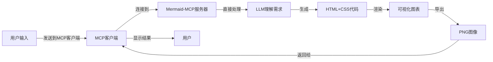

# Mermaid-MCP

一个基于Model Context Protocol (MCP)的Mermaid流程图生成服务器，支持将文本输入转换为精美的可视化流程图。

## 项目简介

Mermaid-MCP是一个强大的MCP服务器，允许各种AI客户端（如Claude、Cursor等支持MCP的工具）连接并生成精美的流程图。用户只需提供文本描述（如流程图需求说明、Mermaid代码、结构化文本或思维导图文本），服务器将直接处理这些输入并返回高质量的流程图PNG图像。

### 核心功能

- 🔄 接收并理解用户的文本输入（需求描述、Mermaid代码或结构化文本）
- 🎨 直接生成精美的HTML可视化图表，无需中间Mermaid转换步骤
- 📊 支持多种图表类型和描述方式
- 🖼️ 将生成的HTML图表导出为高质量PNG图像
- 🔌 基于MCP协议，可与任何MCP客户端无缝集成
- 🤖 利用LLM直接理解用户需求并生成图表
- 🎭 支持多种CSS模板，允许用户自定义图表样式

## 工作原理



1. **用户输入处理**：服务器接收用户提供的文本（需求描述、已有Mermaid代码或结构化文本）
2. **LLM直接理解**：LLM直接理解用户需求，无需中间转换步骤
3. **HTML生成**：LLM直接生成包含图表的HTML和CSS代码
4. **图像导出**：将HTML图表导出为高质量PNG图像
5. **结果返回**：通过MCP协议将生成的图像返回给客户端

## 安装与设置

### 前提条件

- Python 3.8+
- pip
- 支持MCP的客户端（如Claude Desktop、Cursor等）

### 安装步骤

```bash
# 克隆仓库
git clone https://github.com/yourusername/mermaid-mcp.git
cd mermaid-mcp

# 创建虚拟环境（可选但推荐）
python -m venv venv
source venv/bin/activate  # Linux/macOS
# 或
venv\Scripts\activate  # Windows

# 安装依赖
pip install -r requirements.txt

# 启动服务器
python src/server.py
```

## 使用方法

### 连接MCP客户端

在支持MCP的客户端（如Claude Desktop）中，添加本地MCP服务器：

1. 打开客户端设置
2. 找到"MCP服务器"或"模型上下文协议"部分
3. 添加新服务器，指向`http://localhost:5000`（或您设置的端口）
4. 连接服务器

### 生成流程图

连接成功后，您可以通过以下方式使用此服务：

1. **直接描述需求**：
   ```
   请生成一个展示用户注册流程的流程图，包括注册、验证邮箱、完善信息和激活账户步骤。
   ```

2. **提供Mermaid代码**：
   ```
   生成此流程图的PNG：
   graph TD
       A[开始] --> B[步骤1]
       B --> C[步骤2]
       C --> D[结束]
   ```

3. **提供结构化文本**：
   ```
   处理以下结构化文本并创建流程图：
   1. 用户提交申请
   2. 系统审核
     2.1 自动检查
     2.2 人工审核
   3. 发送结果通知
   ```

### CSS模板选择

用户可以通过添加模板参数来选择或自定义图表样式：

```
使用"暗黑"模板生成一个系统架构图，包括前端、后端和数据库三个主要组件。
```

或者：

```
使用以下CSS样式生成流程图（用户可以提供自定义CSS）：
.node {
  border-radius: 15px;
  background: linear-gradient(145deg, #3498db, #2980b9);
  color: white;
  font-weight: bold;
}
.edge {
  stroke: #e74c3c;
  stroke-width: 2px;
}
```

## 支持的图表类型

Mermaid-MCP支持多种图表类型的描述方式：

- 流程图 (Flowcharts)
- 时序图 (Sequence Diagrams)
- 类图 (Class Diagrams)
- 状态图 (State Diagrams)
- 实体关系图 (Entity Relationship Diagrams)
- 甘特图 (Gantt Charts)
- 饼图 (Pie Charts)
- 用户旅程图 (User Journey)

## 自定义选项

服务器支持多种自定义选项：

- **CSS模板**：选择预设模板（默认、暗色、简约、商务等）
- **自定义CSS**：提供您自己的CSS样式覆盖默认样式
- **图表尺寸**：调整生成图表的宽度和高度
- **颜色方案**：选择预定义的颜色组合
- **导出设置**：调整PNG分辨率和质量

## 技术架构

Mermaid-MCP基于以下技术构建：

- **Python**：服务器开发语言
- **Model Context Protocol (MCP)**：用于与AI客户端通信的开放协议
- **Flask/FastAPI**：Web服务器框架
- **LLM**：直接理解用户需求并生成HTML/CSS代码
- **Selenium/Playwright**：用于HTML到PNG的转换
- **Jinja2**：模板引擎，用于HTML生成

## 项目结构

```
mermaid-mcp/
├── src/
│   ├── server.py          # MCP服务器主程序
│   ├── llm_handler.py     # LLM请求处理
│   ├── renderer.py        # HTML渲染器和PNG导出
│   ├── templates/         # CSS模板目录
│   │   ├── default.css
│   │   ├── dark.css
│   │   └── ...
│   └── utils/             # 工具函数
├── requirements.txt       # 项目依赖
└── README.md              # 项目文档
```

## 贡献指南

我们欢迎社区贡献！如需参与：

1. Fork本仓库
2. 创建您的特性分支 (`git checkout -b feature/amazing-feature`)
3. 提交更改 (`git commit -m 'Add some amazing feature'`)
4. 推送到分支 (`git push origin feature/amazing-feature`)
5. 提交Pull Request

## 许可证

本项目采用MIT许可证 - 详见 [LICENSE](LICENSE) 文件

## 联系方式

如有问题或建议，请通过以下方式联系我们：

- 提交GitHub Issue
- 发送电子邮件至：your.email@example.com

---

**Mermaid-MCP** - 让流程图创建变得简单而优雅
